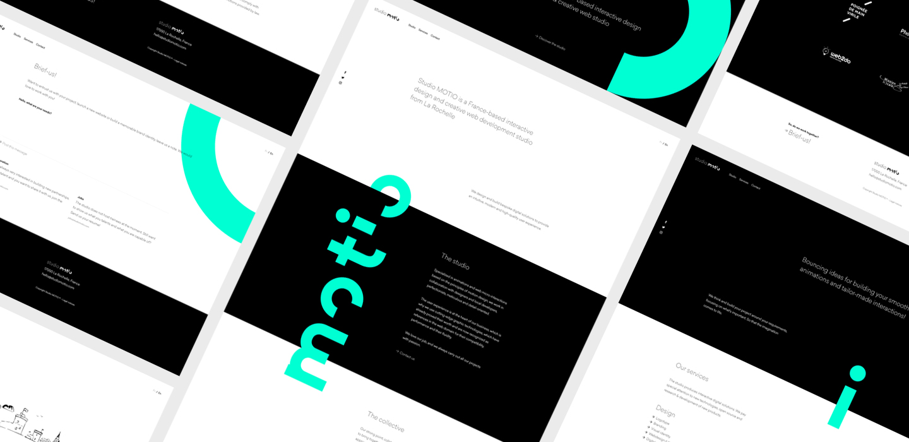
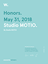

# www
This is the official **portfolio website of Studio MOTIO**, a France-based interactive design & creative web studio from La Rochelle.

## Awards
On May 12, 2018, the site is awarded as **Website Of The Day** on CSS Design Awards and won **best UI**, **best UX** and **best Innovation** awards. CSS Design Awards is an international web design and development award platform that honors and showcases freelance designers, studios and agencies for work that pushes the boundaries of UI, UX and innovative development.

&nbsp;
&nbsp;
&nbsp;

On May 31, 2018, the site is nominee for **Site Of The Day** on Awwwards and won a **Mobile Excellence** and an **Honorable Mention** awards. Awwwards is a community that recognize the talent and effort of the best web designers, developers and agencies in the world.

&nbsp;

On November 15, 2018, the site is awarded for **Site Of The Day** on French Design Index. French Design Index promote talent of designers all over the world with the French Design Index Award.

## Compatibility
This website **officially runs on** Chrome 60+, Firefox 55+, Opera 50+, Safari 10+ and Edge 16+.
Many other browsers may work, but are not extensively tested.

## Build with
- mojs, by [@legomushroom](https://github.com/mojs/mojs)
- barbajs, by [@luruke](https://github.com/luruke/barba.js)
- emergencejs, by [@xtianmiller](https://github.com/xtianmiller/emergence.js)
- typeit, by [@alexmacarthur](https://github.com/alexmacarthur/typeit)
- smooth scrolling, by [@baptistebriel](https://github.com/baptistebriel/smooth-scrolling)
- foundation framework, by [@zurb](https://github.com/zurb/foundation-sites)
- webpack, by [@webpack](https://github.com/webpack/webpack)
- javascript es6
- less
- php7

## License
The project is developed under the **MIT** license:

- **Permissions**: This software and derivatives may be used for commercial purposes, you may distribute this software, this software may be modified and you may use and modify the software without distributing it.
- **Conditions**: Include a copy of the license and copyright notice with the code.
- **Limitations**: Software is provided without warranty and the software author/license owner cannot be held liable for damages.

Read the [full license](LICENSE.md) for more information about your rights.

## Questions?
If you have any questions, please **feel free to contact us!**  
[hello [at] studiomotio.com](mailto:hello@studiomotio.com)
